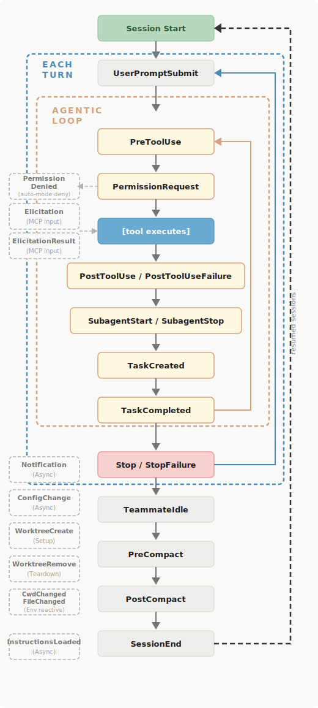

# Hooks

Hooks trigger on specific events during Claude Code execution.



With hooks, you can trigger scripts during the different stages of Claude Code’s lifecycle. This can be usefull to:

- Manage Claude Code tool usage permissions
- Log Claude Code’s actions for monitoring
- Enforce strict guidelines that Claude Code cannot avoid at a given lifecycle stage

Hooks can be complicated, but they can reduce the use of Claude Code by using scripts which do not consume tokens, do not take time and always give the same result. As you refine your understanding of Claude Code’s lifecycle, you will find that a hook at a right place can transform your experience with Claude Code from a frustating experience to a stroll in the park.

Here is an example of a hook that uses 2 scripts to validate that Claude Code uses the right subagent for the job and add a note to the memory to avoid doing the same mistake again if it tries to do so:

Hook: `.claude/settings.json`

```
{
  "hooks": {
    "PreToolUse": [
      {
        "matcher": "Agent",
        "hooks": [
          {
            "type": "command",
            "command": "\"$CLAUDE_PROJECT_DIR\"/.claude/scripts/agent_selection_validation.sh"
          }
        ]
      },
    ],
  }
}

```

Script 1: `.claude/scripts/agent_selection_validation.sh`

```
#!/bin/bash

# Validates that the main Claude session follows the correct agent handoff workflow.
# Called automatically by the PreToolUse hook for the Agent tool in .claude/settings.json.

INPUT=$(cat)
SUBAGENT_TYPE=$(echo "$INPUT" | jq -r '.tool_input.subagent_type // empty')
AGENT_PROMPT=$(echo "$INPUT" | jq -r '.tool_input.prompt // empty')

if [[ "$SUBAGENT_TYPE" == "backend" ]]; then
    if echo "$AGENT_PROMPT" | grep -qiE '(migration skill|/migration|just migration|just migrate|migrate-new|schema change|add.*table|create.*table|alter.*table)'; then
        REASON='Blocked: use the Skill tool with skill="migration" for schema changes — do not delegate migration work to @backend. The correct sequence is: Skill(migration) → Agent(backend) for propagation only.'
        "$CLAUDE_PROJECT_DIR"/.claude/scripts/update_memory.sh 'Use the Skill tool with skill="migration" for schema changes — do not delegate migration work to @backend. The correct sequence is: Skill(migration) → Agent(backend) for propagation only.'
        jq -n --arg reason "$REASON" '{hookSpecificOutput: {hookEventName: "PreToolUse", permissionDecision: "deny", permissionDecisionReason: $reason}}'
        exit 0
    fi

    if echo "$AGENT_PROMPT" | grep -qiE '(write.*test|add.*test|update.*test|fix.*test|create.*test|tests/|just test|@test)'; then
        REASON="Blocked: do not delegate test writing or updates to @backend — that is @test's responsibility. The correct sequence is: Agent(backend) → Agent(test)."
        "$CLAUDE_PROJECT_DIR"/.claude/scripts/update_memory.sh "Do not delegate test writing or updates to @backend — that is @test's responsibility. The correct sequence is: Agent(backend) → Agent(test)."
        jq -n --arg reason "$REASON" '{hookSpecificOutput: {hookEventName: "PreToolUse", permissionDecision: "deny", permissionDecisionReason: $reason}}'
        exit 0
    fi
fi

exit 0
```

Script 2: `.claude/scripts/update_memory.sh`

```
#!/bin/bash

# Appends a memory entry to the project's MEMORY.md if it doesn't already exist.
# Usage: update_memory.sh "<entry text>"

ENTRY="$1"
MEMORY_FILE="$HOME/.claude/projects/$(echo "$CLAUDE_PROJECT_DIR" | sed 's|/|-|g')/memory/MEMORY.md"

if [[ -z "$ENTRY" ]]; then
    exit 0
fi

mkdir -p "$(dirname "$MEMORY_FILE")"
touch "$MEMORY_FILE"

if ! grep -qF "$ENTRY" "$MEMORY_FILE"; then
    echo "$ENTRY" >> "$MEMORY_FILE"
fi
```
