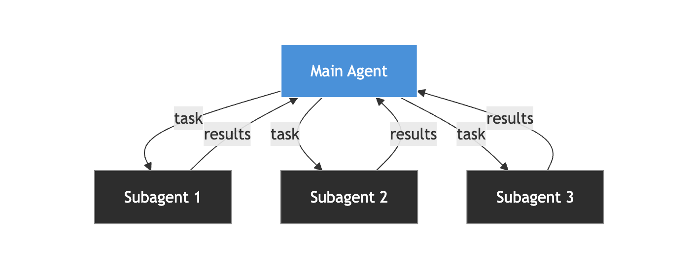

# Subagents

In Claude Code, the agent is your session, a subagent is a child sub-context from this session. This subcontext is controlled by the main agent thread but does not contain any information from the main context unless specified otherwise.

## Advantages and Inconvenients

The main benefits of using subagents are:

- Reducing the size of the main context
- Avoiding context bias by keeping each subagent out of the errors made by other subagents or the main context

However it does:

- Complexify Task Coordination by adding a communication layer
- Duplicate information by having to share it accross all subagents

Subagents can be usefull in the case of big tasks, but can normally be avoided. The communication layer takes a lot of time to setup correctly.

## Installation

Unfortunately there is no CLI to simplify the subagents installations.
For Claude Code, use [plugins](./plugins.md).

For most other coding tools like:

- Codex
- Cursor
- Gemini
- Copilot
- VS Code
- Zed

Use the common AGENTS.md file naming.

use [AGENTS.md](https://agents.md):

1. Clone the repository
2. Copy paste the file into your repository at the root and ask your coding agents to set it up.

## Using Subagents

Here are some tips for using subagents:

- Keep the main session the coordinator of all subagents and give it a skill to plan and delegate
- Tell the main session to use the Claude Code internal tool **Task Create** to make sure it does not lose track of it’s progress (often the case).
- In `settings.json` you can use the `agent` key to run the main thread as a named subagent
- Set the `memory: project` into your subagent so it can adapt to your corrections, see [enable persistent memory](https://code.claude.com/docs/en/sub-agents#enable-persistent-memory)
