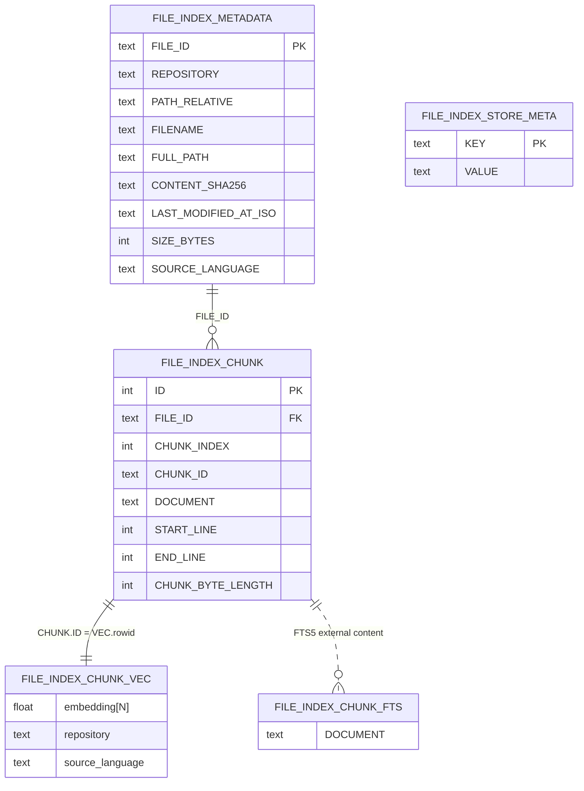

# Semantic index database (SQLite)

This document describes the **semantic index** SQLite file used by `SqliteSemanticIndexStore` (`src/semantic-service/persistence/sqlite/sqlite-semantic-index.store.ts`). The DDL (Data Definition Language) lives in `src/semantic-service/persistence/sqlite/semantic-index-sqlite.schema.ts`.

Pragmas applied at open: `journal_mode = WAL`, `foreign_keys = ON`.

## Entity-relationship diagram

Hybrid search runs sqlite-vec KNN and FTS5 lexical retrieval in parallel, then fuses **ranked lists** with **Reciprocal Rank Fusion (RRF)** in `fuseChunkMatchesWithRRF` (`src/semantic-service/search/hybrid-chunk-fusion.utils.ts`): default **70%** weight on vector branch ranks, **30%** on lexical, smoothing constant **`rrfK = 60`**. Called from `runWorkspaceSemanticQuery` after BM25 and distance-ordered lists are built (`workspace-semantic-query.service.ts`). This step does **not** use per-query min–max normalization on branch scores.

**Language filters (queries):** optional KNN filters use `v.source_language` on vec0 with `OR` of equality predicates (sqlite-vec vec0 constraints). Optional lexical filters use `f.SOURCE_LANGUAGE IN (SELECT value FROM json_each(?))` against file metadata (`sqlite-semantic-index.store-statements.ts`).

## Configuration

The database file path comes from `CODE_CRAWLER_SEMANTIC_INDEX_DB_PATH` (see `.env.example` and `src/utils/env.utils.ts`). Embedding width `N` must match the configured model; changing dimensions requires a new database or a full rebuild so `vec0` stays consistent.
