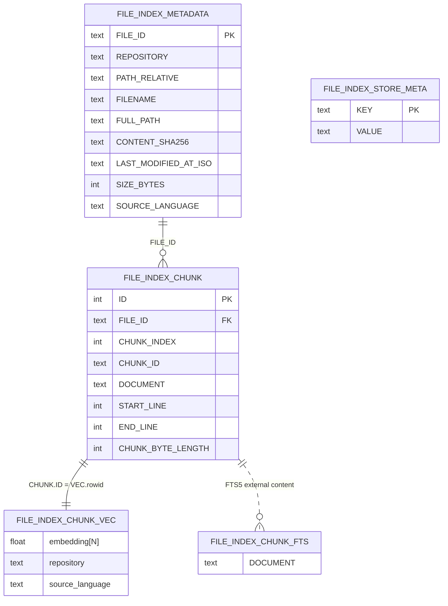

# Semantic index database (SQLite)

This document describes the **semantic index** SQLite file used by `SqliteSemanticIndexStore` (`src/semantic-service/persistence/sqlite/sqlite-semantic-index.store.ts`). The DDL (Data Definition Language) lives in `src/semantic-service/persistence/sqlite/semantic-index-sqlite.schema.ts`.

Pragmas applied at open: `journal_mode = WAL`, `foreign_keys = ON`.

## Entity-relationship diagram

## Tables and indexes

| Object | Kind | Notes |
| --- | --- | --- |
| `FILE_INDEX_METADATA` | table | One row per indexed file. `UNIQUE(REPOSITORY, PATH_RELATIVE)`. `SOURCE_LANGUAGE` is `TEXT NOT NULL` at SQL level (no DB enum/check); values like `typescript`, `javascript`, `python`, `cpp`, `csharp` are an app-level convention used for hybrid-search filters. |
| `IDX_FILE_INDEX_METADATA_SOURCE_LANGUAGE` | index | On `SOURCE_LANGUAGE`. |
| `FILE_INDEX_CHUNK` | table | Chunk text and line span. `CHUNK_ID` is `UNIQUE`. `FOREIGN KEY (FILE_ID)` → `FILE_INDEX_METADATA(FILE_ID)` `ON DELETE CASCADE`. |
| `IDX_FILE_INDEX_CHUNK_FILE_CHUNK_INDEX` | unique index | On `(FILE_ID, CHUNK_INDEX)`. |
| `FILE_INDEX_STORE_META` | table | Store-level key/value (e.g. `EMBEDDING_DIM` = width used for vec0). |
| `FILE_INDEX_CHUNK_VEC` | virtual (`vec0`) | sqlite-vec KNN; columns `embedding float[N]`, `repository TEXT`, and `source_language TEXT` (metadata on `v`, same value as `FILE_INDEX_METADATA.SOURCE_LANGUAGE`, so language filters apply during KNN per sqlite-vec vec0). |
| `FILE_INDEX_CHUNK_FTS` | virtual (`fts5`) | Full-text index on chunk `DOCUMENT` (BM25). **External content** on `FILE_INDEX_CHUNK` (`content_rowid='ID'`). Maintained by triggers on `FILE_INDEX_CHUNK`. |
| `TRG_FILE_INDEX_CHUNK_FTS_AI` | trigger | `AFTER INSERT` on `FILE_INDEX_CHUNK`: inserts `(rowid, DOCUMENT)` in `FILE_INDEX_CHUNK_FTS`. |
| `TRG_FILE_INDEX_CHUNK_FTS_AD` | trigger | `AFTER DELETE` on `FILE_INDEX_CHUNK`: writes FTS `'delete'` row for old content. |
| `TRG_FILE_INDEX_CHUNK_FTS_AU` | trigger | `AFTER UPDATE` on `FILE_INDEX_CHUNK`: writes `'delete'` for old content, then inserts new `(rowid, DOCUMENT)`. |

Hybrid search combines sqlite-vec KNN with FTS5 `bm25()` scores (fixed **70 % / 30 %** blend in `fuseHybridChunkMatches` after per-query min-max normalization).

**FTS lifecycle (idempotent):** on open, `SqliteSemanticIndexStore` ensures FTS triggers always exist; if the FTS table is missing it creates it, then runs `rebuild` only when `FILE_INDEX_CHUNK` already has rows. If the FTS table exists, it runs `rebuild` only when chunk rows exist and the FTS index is empty (handy for a reused local file). There is no separate production migration path for this dev-oriented SQLite index.

## Chunk rows and vectors (application link)

There is **no SQL foreign key** between `FILE_INDEX_CHUNK` and `FILE_INDEX_CHUNK_VEC`. The store **inserts the vector row first**, then inserts the chunk row with `ID` equal to the vector insert’s `lastInsertRowid` (the vec table **rowid**). Deletes remove vec rows by that same id (`DELETE FROM FILE_INDEX_CHUNK_VEC WHERE rowid = ?`). See `replaceIndexedFile` in `src/semantic-service/persistence/sqlite/sqlite-semantic-index.store.ts`.

## Configuration

The database file path comes from `CODE_CRAWLER_SEMANTIC_INDEX_DB_PATH` (see `.env.example` and `src/utils/env.utils.ts`). Embedding width `N` must match the configured model; changing dimensions requires a new database or a full rebuild so `vec0` stays consistent.
