## code-crawler — storyboard présentation

### Slide 1 — code-crawler : cadrage

#### Produit

- Recherche **sémantique** **locale** sur **l’ensemble des dépôts Git** sous une racine configurable.
- Index persistant **SQLite** (+ vecteurs), serveur **MCP** et **REST** dans le même processus.

> <small>Capture de l’arborescence réelle pointée par `CODE_CRAWLER_ROOT` (plusieurs dossiers `.git` visibles).</small>

#### Problème

- On cherche une **idée** ou un **comportement**, pas un nom de symbole exact.
- Le vocabulaire **varie** entre équipes, services ou le dev.

> <small>Ex. *Use code-crawler MCP to find where HTTP retry can be handled when we call an API* (formulation en anglais pour l’agent MCP et de meilleurs résultats sémantiques).</small>

#### Promesse

- **Un serveur** : indexation + recherche + exposition **MCP** (`/mcp`) et **API** (`/api`).
- Données et modèle d’embedding **dans votre environnement** (pas de SaaS imposé pour l’index).

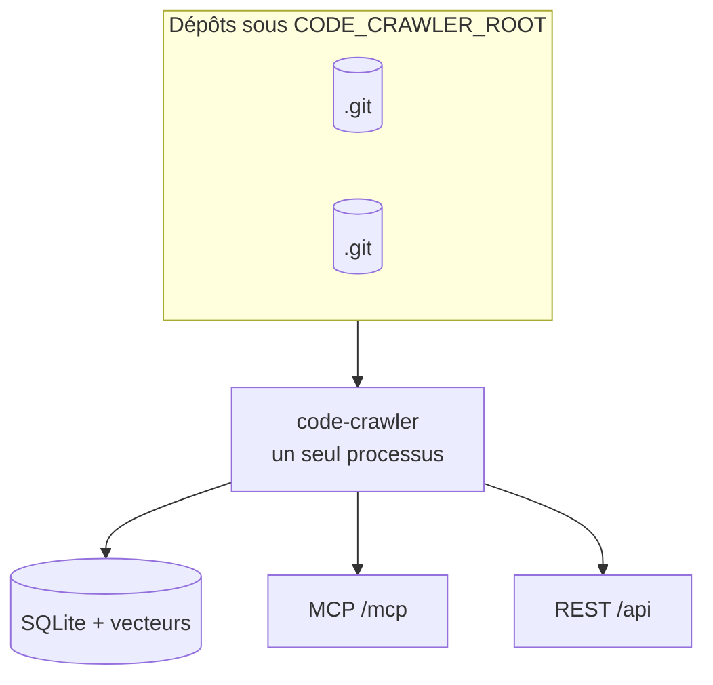

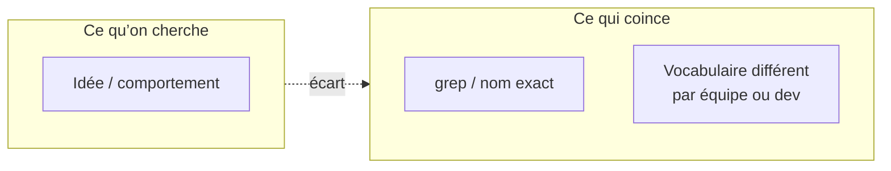

---

### Slide 2 — Public et valeur entreprise

#### Pour qui ?

- **Développeurs** : navigation par intention, outillage MCP dans l’IDE.
- **Profils métier « tech-aware »** : vision transverse du patrimoine, cycles de vie, rationalisation.

> <small>Deux colonnes ou deux icônes « Dev » / « Produit & archi ».</small>

#### Transversalité

- Même recherche (prompt **en anglais**, idéalement via MCP) sur **plusieurs produits** ou dépôts : patterns, conventions, dettes.
- Onboarding, audit technique, **"Who already does X?"** sans ouvrir dix clones.

> <small>Métaphore « carte du territoire » ou schéma : plusieurs dépôts sous une racine.</small>

#### Intention vs mots-clés

- Questions en **langage naturel** (de préférence **en anglais** pour l’agent MCP et la qualité sémantique) quand les noms diffèrent (`fetchRetry`, `withRetry`, etc.).
- Moins de dépendance au **grep** exact sur l’ensemble des dépôts.

> <small>Le même type de prompt en anglais qu’à l’ouverture, avec deux extraits de code fictifs aux noms différents pour illustrer l’écart lexical.</small>

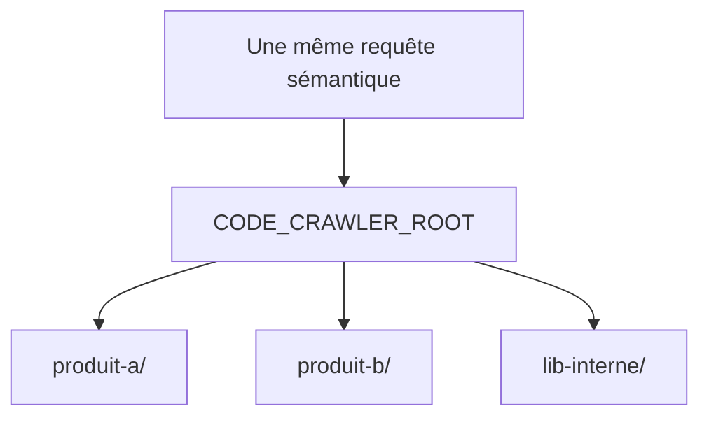

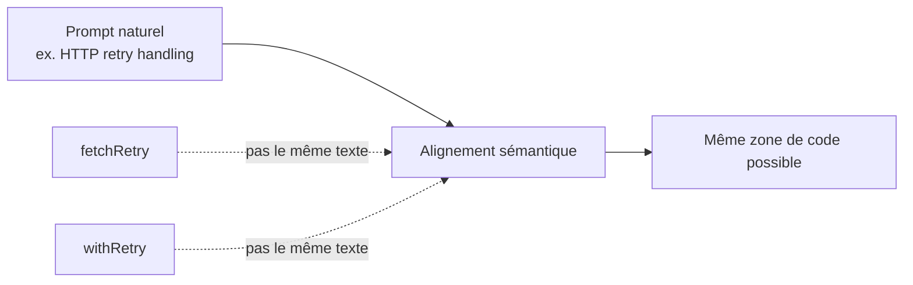

---

### Slide 3 — Où ça s’insère dans l’IDE

#### Complémentaires aux agents d'IA

- Les assistants excellent sur le **contexte ouvert** (fichiers du workspace, conversation).
- Atouts : **complétion / assistance inline** liée à la session courante dans l’éditeur.
- code-crawler
  - apporte un **index préparé** et **outillé** sur **tout le sous-arbre de dépôts** sous la racine.
  - aspect **exploration du patrimoine** et cohérence **multi-dépôts**.

> <small>Capture d’un `mcp.json` (entrée `url` vers `http://127.0.0.1:3333/mcp`) comme dans [README.md](../README.md).</small>

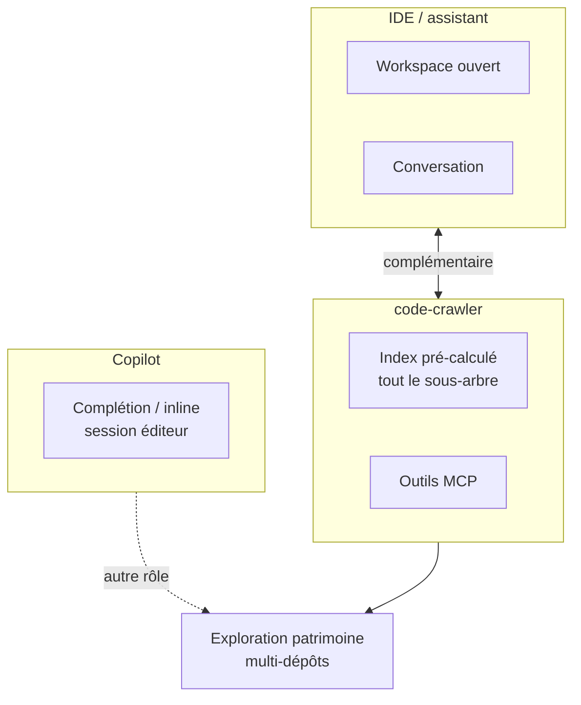

---

### Slide 4 — Sémantique et stack d’embedding

#### Recherche sémantique en 30 secondes

- **Lexicale** : le mot est dans le fichier.
- **Sémantique** : le fichier **ressemble** à la question en **sens** — représentation numérique (vecteur).

> <small>Deux points dans un nuage avec légende « proche en sens ».</small>

#### Où tourne l’embedding ?

- **Transformers.js** (`@huggingface/transformers`) **dans le processus Node** du serveur.
- Pas besoin d’un service cloud dédié aux embeddings pour **construire l’index** (le modèle et ses poids sont locaux une fois en place).

> <small>Liste courte des noms techniques au centre de la slide.</small>

#### `feature-extraction` : texte → vecteur

- Pipeline Hugging Face : tâche **`feature-extraction`** sur l’id de modèle configuré.
- **Pooling `mean`**, **normalisation** — une ligne numérique de dimension fixe (ex. 768 selon `.env`).

> <small>Capture 8–12 lignes de [`language-model-embedding.pipeline.ts`](../src/semantic-service/language-model-embedding.pipeline.ts) autour de `pipeline("feature-extraction", model)`.</small>

#### Poids du modèle (fichiers)

- Les **poids** du réseau = fichiers du modèle (ONNX / assets) sous `CODE_CRAWLER_TRANSFORMERS_MODELS_PATH`.
- Premier lancement possible : **téléchargement** puis cache ; scripts `yarn download:models:embeddings` pour préparer hors ligne.

> <small>Explorateur de fichiers ouvrant un sous-dossier type `jinaai/jina-embeddings-v2-base-code`.</small>

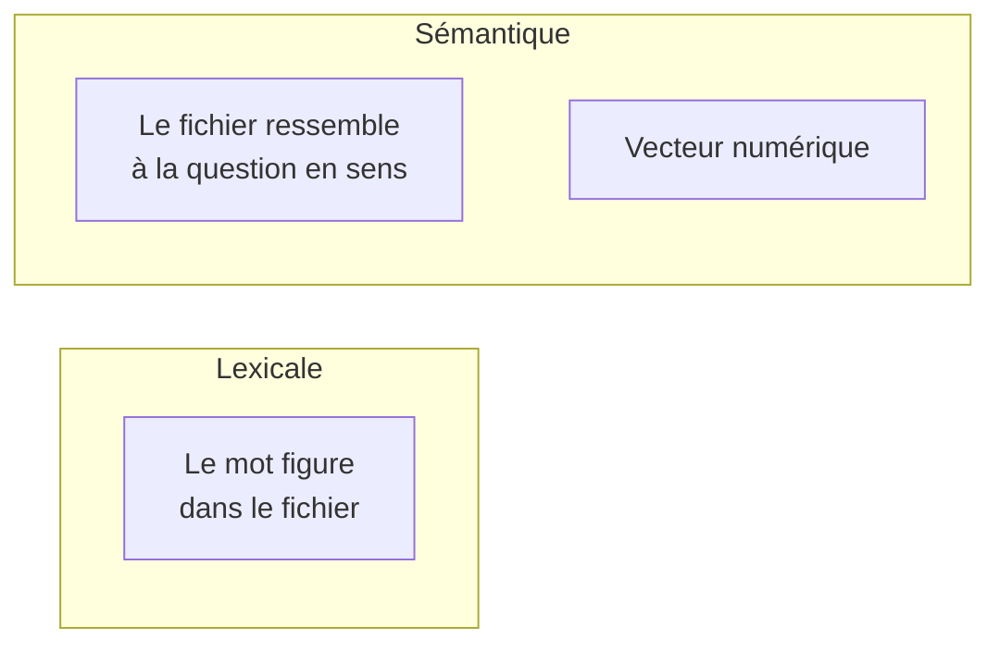

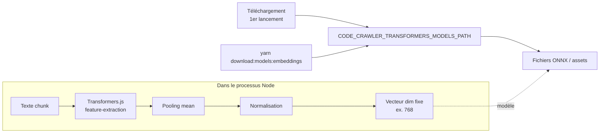

---

### Slide 5 — Pipeline global et ce qui est indexé

#### De la source à la base

- Parcours logique : fichiers → filtres → **chunks** → **embeddings** → persistance **SQLite**.

> <small>Exporter en image le diagramme ci-dessous (Mermaid) pour PowerPoint si besoin.</small>

#### Découverte : que lit-on ?

- Racine : `CODE_CRAWLER_ROOT` (ou `rootDir` passé aux outils).
- Dossiers exclus : `.git`, `node_modules`, `dist`, etc. — constante `INDEX_SKIP_DIR_NAMES` dans [`repository-file-records.utils.ts`](../src/semantic-service/indexing/repository-file-records.utils.ts).
- **Aujourd’hui dans le code** : extensions indexées **`.ts` et `.tsx` uniquement** (à mentionner clairement pour ne pas sur-promettre).

> <small>Capture des listes `INDEX_SKIP_DIR_NAMES` et `INDEX_ALLOWED_FILE_EXTENSIONS` dans le même fichier.</small>

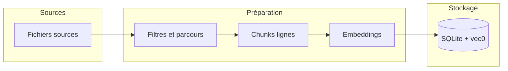

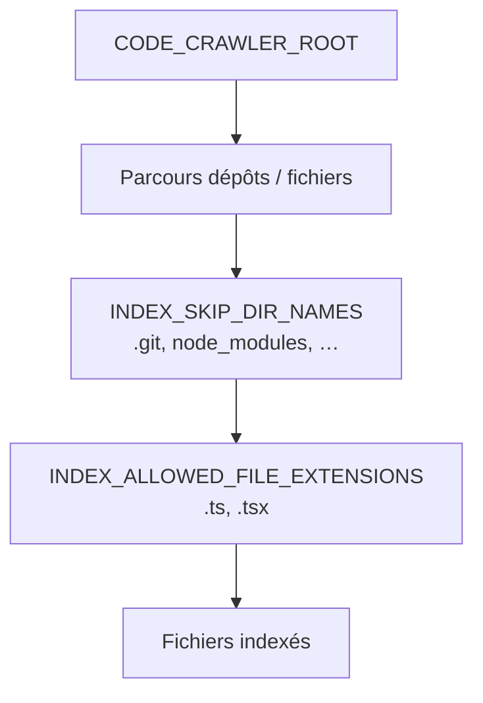

---

### Slide 6 — Chunks et texte embeddé

#### Chunks : fenêtres de lignes

- Découpage **par lignes** avec **recouvrement** (overlap) — évite de couper le contexte net.
- Limites pilotées par l’environnement : `CODE_CRAWLER_CHUNK_MAX_CHARS`, `CODE_CRAWLER_CHUNK_MAX_LINES`, `CODE_CRAWLER_CHUNK_OVERLAP_LINES` (voir [`.env.example`](../.env.example)).

> <small>Capture de l’en-tête et de `export const buildSemanticLineChunks` dans [`line-window-chunking.utils.ts`](../src/semantic-service/line-window-chunking.utils.ts).</small>

#### Quoi embedder exactement ?

- Chaque morceau devient un texte avec **contexte** : préfixe du type `File: …` / `Repo: …` puis le corps du chunk.
- Objectif : que le vecteur «sache» dans quel fichier et quel dépôt se situe le fragment.

> <small>Une ligne de pseudo-code ou de log montrant la concaténation.</small>

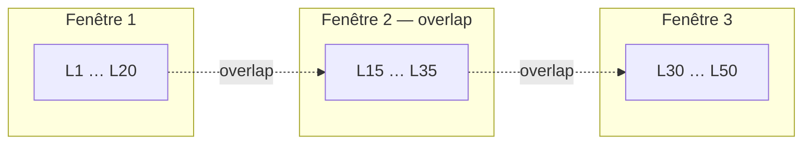

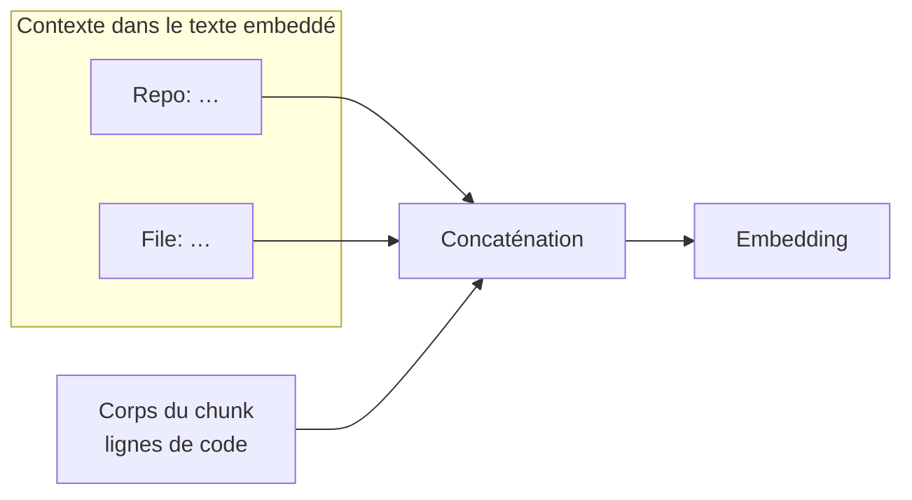

---

### Slide 7 — Modèle de données et lecture SQLite

#### Schéma de données (vue ER)

- Métadonnées fichier, lignes **chunk** (texte, plages de lignes), table virtuelle **vecteurs** (`vec0`).
- Lien applicatif : **`CHUNK.ID` aligné sur le `rowid` du vecteur** (détails dans [DATABASE.md](./DATABASE.md)).

> <small>Figure exportée depuis le diagramme `erDiagram` dans [DATABASE.md](./DATABASE.md).</small>

#### À l’écran : que voit-on dans SQLite ?

- `FILE_INDEX_METADATA` : dépôt, chemin, SHA du contenu, etc.
- `FILE_INDEX_CHUNK` : `DOCUMENT`, `START_LINE`, `END_LINE` — le **texte** cherchable côté humain ; vecteur en blob ailleurs.

> <small>**SQLite Browser** ou terminal : `SELECT … LIMIT 3` sur métadonnées puis sur chunks (colonnes texte seulement), pour opposer « lisible » et « binaire vecteur ».</small>

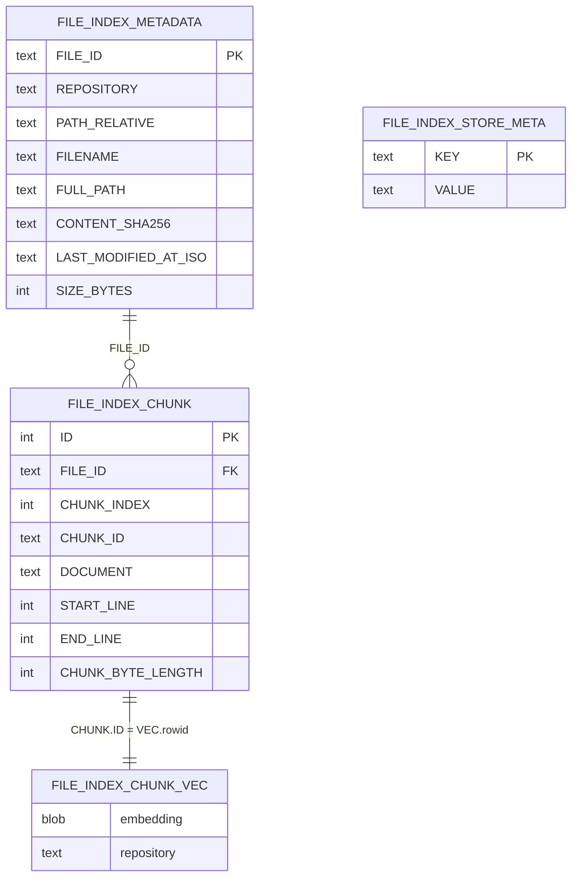

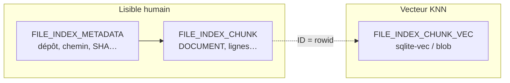

---

### Slide 8 — Requête, consolidation et classement

#### À la requête

- La **question** est embeddée avec le **même** pipeline que les chunks.
- **Plus proches voisins** dans l’espace vectoriel (sqlite-vec), puis **regroupement par fichier** pour la réponse présentée.

> <small>**Démo live** : UI [`public/search/search-codebase`](../public/search/search-codebase.js) dans le navigateur, ou appel REST sous `/api` comme dans [README.md](../README.md).</small>

#### « Poids » des résultats (classement)

- **Distance** entre vecteur requête et vecteurs indexés (plus petit = plus proche).
- Si **plusieurs chunks** du **même fichier** ressortent : **boost** (distance effective divisée par `1 + 0,25 × (nombre de hits − 1)` — voir [`match-consolidation-by-file.utils.ts`](../src/semantic-service/search/match-consolidation-by-file.utils.ts)).

> <small>Capture d’une ligne avec la constante `0.25` et le commentaire sur le diviseur.</small>

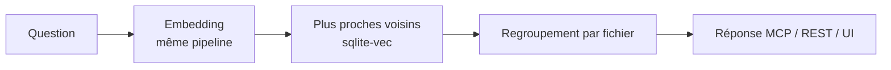

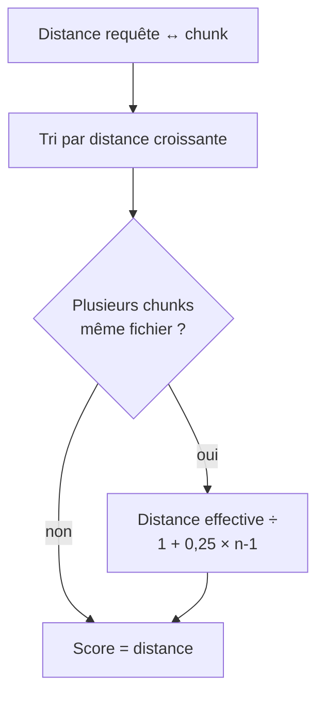

---

### Slide 9 — Limites, échelle et sécurité

#### Limites à connaître

- Changement de **modèle** ou de **dimension** d’embedding ⇒ **nouvelle base** ou réindex complète (`CODE_CRAWLER_EMBEDDING_DIM` cohérent avec le modèle).
- **RAM** et taille des modèles : ajuster `CODE_CRAWLER_EMBED_BATCH_SIZE` si besoin.
- **Échelle** : sqlite-vec convient jusqu’à des ordres de grandeur «grande équipe» ; au-delà, évaluer d’autres magasins vectoriels (cf. TODOs README).

#### Sécurité et périmètre

- Serveur **sans authentification** intégrée ; lier à **`127.0.0.1`** en usage courant.
- Ne pas exposer le port sur Internet sans **TLS + auth** maison.

> <small>Voir la section **Security** du [README.md](../README.md).</small>

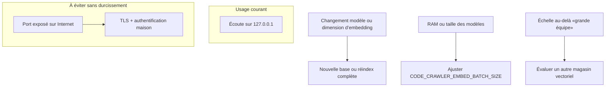

---

### Slide 10 — Démos, ressources, clôture

#### Démos live

- **Terminal** : `yarn start:prod` puis logs `embed batch` pendant l’indexation.
- **MCP Inspector** : `yarn inspector` avec URL `http://127.0.0.1:3333/mcp`.
- **Cursor** : prompt en anglais du type *Use code-crawler MCP to …* puis appel d’un outil MCP `semantic-search-workspace-files` (ou équivalent) montrant des fichiers retournés.

> <small>Visuels possibles : fenêtre terminal et fenêtre navigateur (Inspector).</small>

#### Ressources & Q/R

- Documentation projet : [README.md](../README.md), schéma base : [DATABASE.md](./DATABASE.md).
- Code d’entrée d’indexation : `runRepositoryIndexingFlow` dans [`repository-indexing.flow.ts`](../src/semantic-service/indexing/repository-indexing.flow.ts) (outils MCP/REST : [`semantic-workspace.tools.ts`](../src/semantic-service/semantic-workspace.tools.ts)).

> <small>QR ou liens complets vers le dépôt et les chemins de documentation.</small>

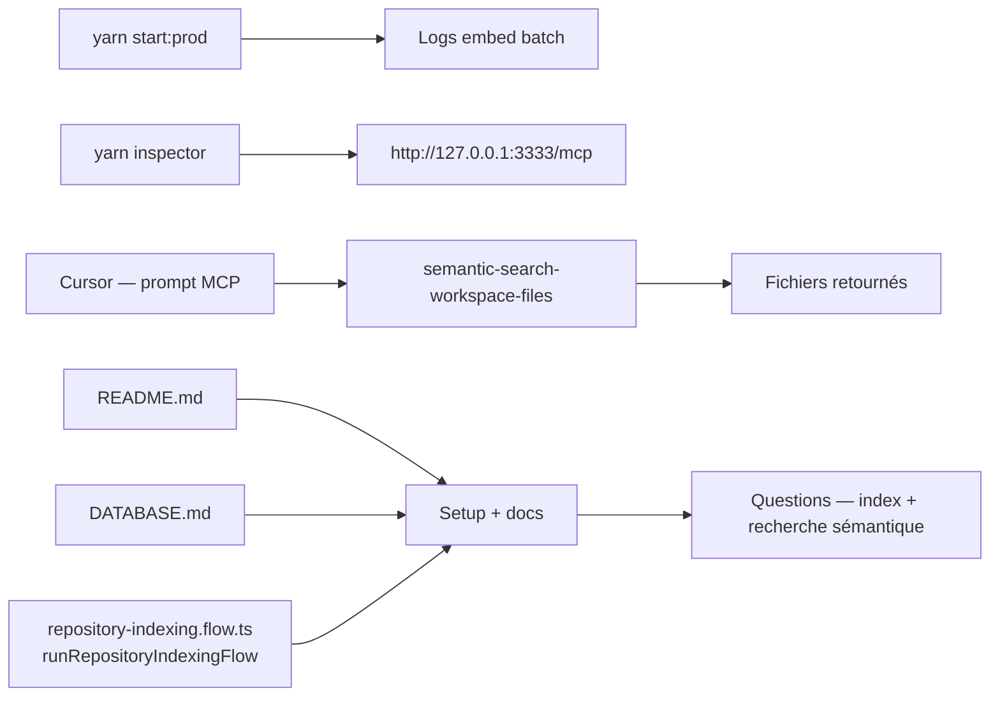
