# code-crawler — Recherche sémantique dans le code (45 min)

> **Audience :** Développeurs + profils techniques non-développeurs
> **Durée :** ~45 min · **11 slides**
> **Fil conducteur :** Chaque slide répond à la question *"pourquoi cette étape existe ?"*

---

## Slide 1 — Le problème : chercher par intention, pas par mot (5 min)

### Message clé

`grep` cherche des **mots exacts**. On veut chercher des **idées**.

### Contenu

Deux fonctions qui font exactement la même chose dans deux langages différents :

```typescript
// TypeScript — service A
async function fetchWithRetry(url: string, maxAttempts = 3): Promise<Response> { … }
```

```python
# Python — service B
def http_retry_wrapper(endpoint: str, max_tries: int = 3) -> requests.Response: …
```

Un `grep -r "retry"` dans un repo qui n'utilise que `http_retry_wrapper` ne retourne **rien**.
La question qu'on veut pouvoir poser : `"find HTTP retry handling"` — et retrouver les deux.

> **Pour les non-développeurs :** c'est comme chercher « voiture » dans une bibliothèque
> dont tous les livres parlent d' « automobile » — même concept, mot différent.

### Diagramme

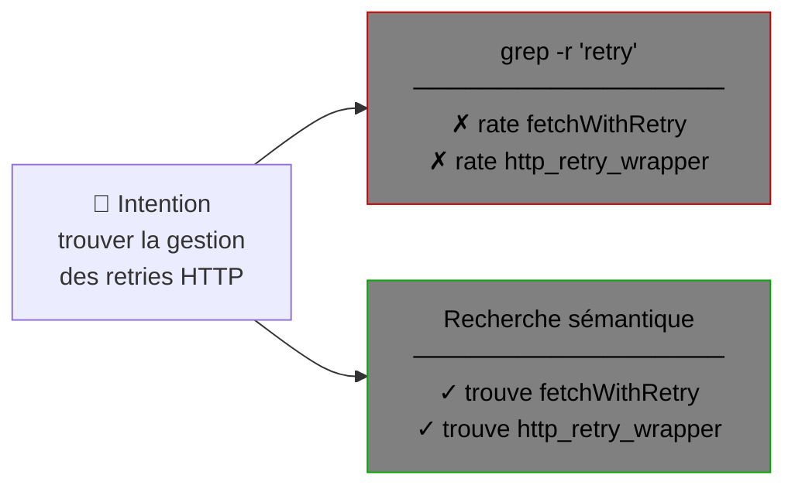

### Démo

1. Terminal : `grep -r "retry" ./src` — montrer les résultats (limités au mot exact)
2. `POST /api/semantic-search-workspace-files` avec `{ "queryText": "HTTP retry handling", "nbResults": 5 }`
3. Comparer : la recherche sémantique remonte les deux fonctions malgré les noms différents

---

## Slide 2 — Ce qu'est un vecteur d'embedding (4 min)

### Message clé

Transformer du texte en **coordonnées dans un espace de sens**.

### Contenu

Un modèle d'embedding convertit un fragment de texte → tableau de ~768 nombres (un **vecteur**).

- Deux textes au **sens proche** → vecteurs **proches** dans l'espace (faible distance)
- Deux textes au **sens éloigné** → vecteurs **éloignés**
- La "distance" mesure le sens, pas les mots

> **Pour les non-développeurs :** imaginez que chaque texte est une étoile dans le ciel.
> Les étoiles proches partagent le même sens. La recherche sémantique = trouver les étoiles
> les plus proches de votre requête.

### Diagramme

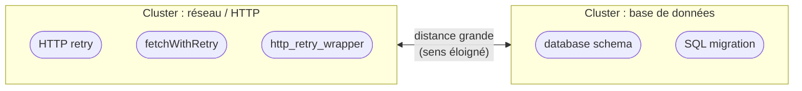

Deux clusters visibles → points proches = sens proche, indépendamment des mots utilisés.

### Pointeurs de code (développeurs)

- `src/semantic-service/language-model-embedding.pipeline.ts` — `embedTextsWithLanguageModel()`
- Modèle : **`jinaai/jina-embeddings-v2-base-code`** (768 dimensions, entraîné sur du code)
- Pipeline : `pipeline("feature-extraction", model)` → mean pooling → L2 normalization

---

## Slide 3 — Pourquoi le code est spécial : les défis (5 min)

### Message clé

Le code n'est pas du texte naturel — un découpage naïf casse le sens.

### Contenu — 4 défis

**Défi 1 — Multi-langages**
TypeScript, Python, C++, C# ont des structures syntaxiques totalement différentes.
Une seule approche de découpage ne peut pas fonctionner pour tous.

**Défi 2 — Les identifiants ne ressemblent pas à des mots**
`buildAggregatedQueryMatchFromFileChunks` n'existe dans aucun dictionnaire.
Un modèle généraliste (entraîné sur Wikipedia) n'en comprend pas le sens → besoin de
modèles **spécialisés code** comme Jina ou CodeBERT.

**Défi 3 — Un découpage fixe brise le contexte**
Couper après 200 lignes peut tomber en plein milieu d'une fonction.
Un chunk incomplet = vecteur peu fiable = mauvais résultats.

**Défi 4 — Les relations entre symboles comptent**
Une fonction qui *appelle* `validateInput()` puis `saveToDb()` dit implicitement
qu'elle fait de la validation ET de la persistance — même si ces mots n'apparaissent pas
dans son corps.

### Diagramme

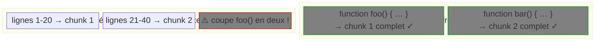

### Pointeurs de code (développeurs)

- Chunkers par langue :
  - `src/semantic-service/chunking/graph-chunks-for-ecmascript.ts` (TypeScript/JavaScript)
  - `src/semantic-service/chunking/graph-chunks-for-python.ts`
  - `src/semantic-service/chunking/graph-chunks-for-cpp.ts`
  - `src/semantic-service/chunking/graph-chunks-for-csharp.ts`
- Registre de langues : `src/semantic-service/chunking/tree-sitter-language-registry.ts`

---

## Slide 4 — La solution : chunks AST + graphe d'appels (5 min)

### Message clé

On découpe selon les **frontières syntaxiques réelles** et on ajoute le contexte de
**qui appelle qui**.

### Contenu

**Tree-sitter** analyse le code source → arbre syntaxique (AST).
On extrait les nœuds signifiants : fonctions, méthodes, classes.

Chaque chunk reçoit un **header contextuel** avant embedding :

```
File: src/semantic-service/search/workspace-semantic-query.service.ts
Repo: code-crawler
Type: Function
Name: runWorkspaceSemanticQuery
Calls: embedTextsWithLanguageModel, queryNearest, fuseHybridChunkMatches
CalledBy: semanticSearchWorkspaceFiles
```

Suivi du corps de la fonction. Ce header est inclus dans le texte embeddé :
le vecteur « sait » **où** se situe le fragment et **ce qu'il fait** dans le graphe d'appels.

> **Pour les non-développeurs :** c'est comme mettre une fiche signalétique sur chaque
> page d'un livre : titre du chapitre, sujets traités, références aux autres chapitres.
> Le modèle indexe la fiche + la page ensemble.

### Diagramme

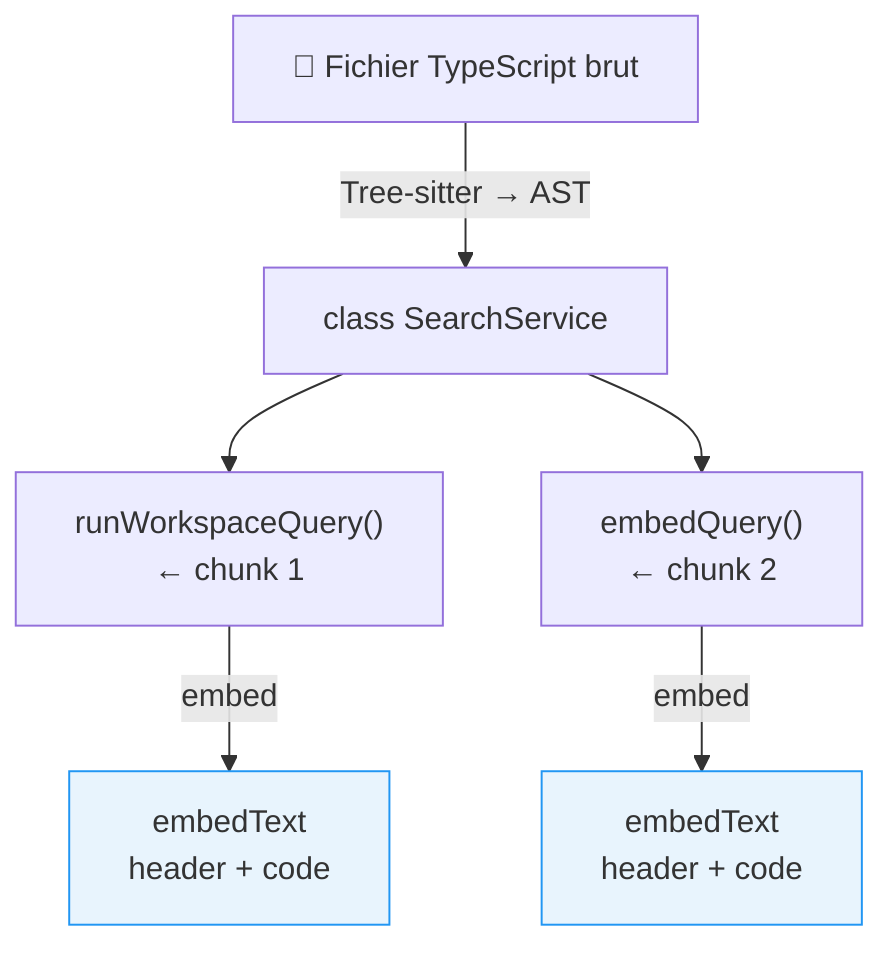

### Pointeurs de code (développeurs)

- `src/semantic-service/chunking/graph-chunks.ts` — `buildSemanticGraphChunksForSource()` (point d'entrée)
- `src/semantic-service/chunking/graph-chunks.utils.ts` — `buildCallsAndCalledBy()`, `buildEmbedHeader()`

### Démo

Montrer un vrai embed text dans SQLite :

```sql
SELECT DOCUMENT FROM FILE_INDEX_CHUNK
WHERE FILE_ID LIKE '%workspace-semantic-query%'
LIMIT 2;
```

Le résultat montre le header + le code source brut concaténés.

---

## Slide 5 — Pipeline d'indexation : de la source à SQLite (3 min)

### Message clé

Pipeline linéaire avec **idempotence SHA-256** : on ne ré-indexe que ce qui a changé.

### Diagramme

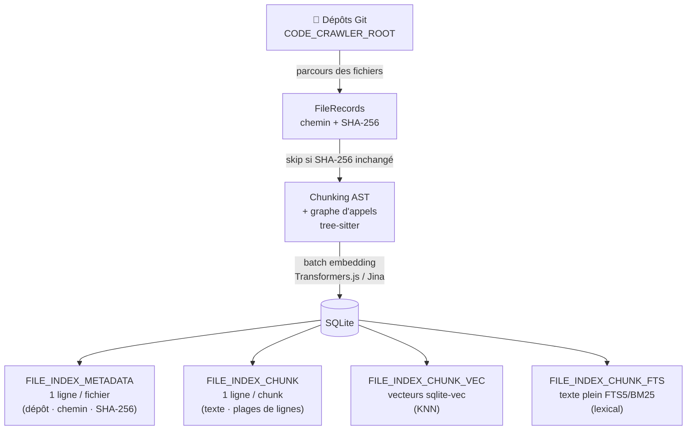

> Les quatre tables sont synchronisées par des triggers SQLite.
> Modifier un fichier = supprimer + recréer ses chunks et vecteurs en transaction.

### Pointeurs de code (développeurs)

- `src/semantic-service/indexing/semantic-index-upsert.pipeline.ts` — `tryUpsertFileRecordsToSemanticIndex()`
- `src/semantic-service/persistence/sqlite/semantic-index-sqlite.schema.ts` — schéma complet

### Démo

```bash
POST /api/prepare-repository-for-semantic-search
{ "repository": "code-crawler" }
```

Observer les logs de batch embedding dans le terminal.

---

## Slide 6 — Multi-query : diversifier les formulations (4 min)

### Message clé

Une seule formulation peut manquer des résultats pertinents.
On génère **N variantes** de la requête, on lance un KNN par variante,
puis on fusionne les listes vectorielles via **RRF à poids égaux**.

### Contenu

**Problème :** La recherche vectorielle est sensible à la formulation.
`"HTTP retry handling"` et `"resilient HTTP request with backoff"` produisent
des vecteurs distincts qui ne remontent pas exactement les mêmes chunks.

**Solution — expansion de requête :**

1. La requête originale est confiée à un LLM
2. Le LLM génère N reformulations : `"network retry logic"`, `"resilient HTTP backoff"` …
3. Chaque variante est embeddée → liste KNN indépendante (5×nbResults chunks chacune)
4. **RRF à poids égaux** fusionne les N listes vectorielles :

```
score_RRF(chunk) = Σᵢ  (1/N) × 1/(60 + rang_i)
```

**Propriété clé :** un chunk présent dans plusieurs listes à bon rang cumule
les contributions — la convergence entre formulations renforce la confiance.

> La BM25 **n'est pas multipliée** : elle s'exécute une seule fois sur la requête
> originale, en aval de la fusion vectorielle (slide 8).

### Diagramme

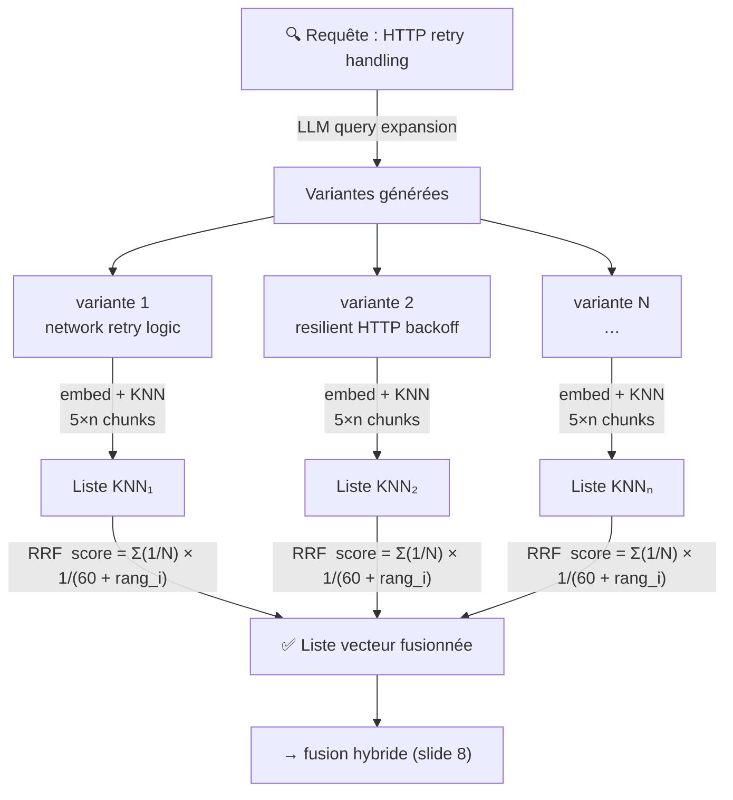

### Pointeurs de code (développeurs)

- `src/semantic-service/search/workspace-semantic-query.service.ts`
  - `expandQueryVariants()` — génère les variantes (stub LLM, à brancher sur un modèle)
  - `retrieveVectorMatchesPerVariant()` — embed et KNN par variante en un seul batch
  - `fuseRankedListsWithEqualWeightRRF()` — RRF avec `rrfK = 60`, poids = 1/N par liste
- Activé via `useMultiQuery: true` dans `RunWorkspaceSemanticQueryArgs`

---

## Slide 7 — KNN : récupérer plus pour trouver mieux (5 min)

### Message clé

La recherche vecteur retourne des **chunks**, pas des fichiers.
On en prend **5× plus que demandé** pour avoir de la matière à consolider.

### Contenu

Pour `nbResults = 10 fichiers` demandés, on récupère `5 × 10 = **50 chunks**`.

**Pourquoi ?**

Un même fichier peut avoir plusieurs chunks pertinents. Si on ne prend que 10 chunks,
un fichier qui contient 3 chunks très pertinents occupe 3 places sur 10 — et on manque
d'autres fichiers intéressants.

En prenant 50 chunks, on donne à l'étape de consolidation (slide 9) suffisamment de
candidats pour travailler.

**KNN via sqlite-vec :**
- Distance cosinus dans `FILE_INDEX_CHUNK_VEC`
- Résultats triés par distance croissante (plus petit = plus similaire)
- Filtrables par `repository` et `language`

### Diagramme

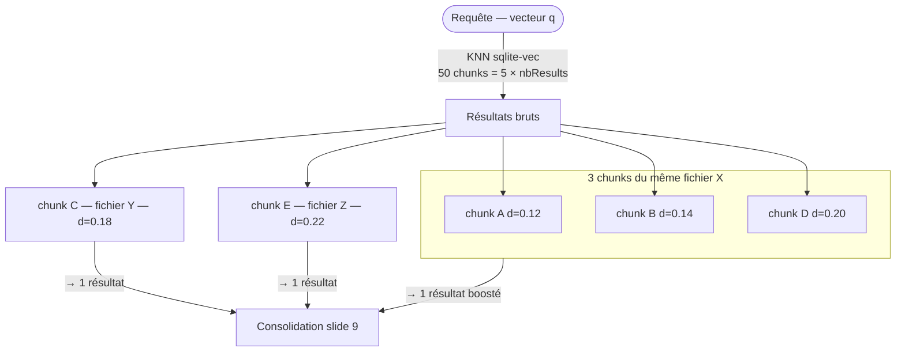

### Pointeurs de code (développeurs)

- `src/semantic-service/search/workspace-semantic-query.service.ts` — `runWorkspaceSemanticQuery()` (ligne ~69)
- `src/semantic-service/search/match-consolidation-by-file.utils.ts` — `resolveChunkFetchCountForFileConsolidation()` : facteur ×5, plafonné à 500

---

## Slide 8 — Recherche hybride : vecteur + lexical via RRF (4 min)

### Message clé

Le vecteur seul **rate les noms exacts**. Le BM25 seul **rate le sens**.
On fusionne les deux listes de rangs via **RRF pondéré** pour cumuler les avantages.

### Contenu

**Cas où le vecteur échoue :**
Chercher `"buildSafeFts5MatchQuery"` — nom trop spécifique pour qu'un modèle d'embedding
en comprenne le sens. La recherche vectorielle ne remonte pas le bon fichier.

**Cas où le BM25 échoue :**
Chercher `"gestion des erreurs réseau"` — aucun fichier TypeScript ne contient
littéralement ces mots français.

**Solution — RRF pondéré :**

```
score = 0.7 / (60 + rang_vecteur) + 0.3 / (60 + rang_lexical)
```

Un chunk absent d'une liste contribue 0 pour cette liste — pas de pénalité arbitraire.

### Diagramme

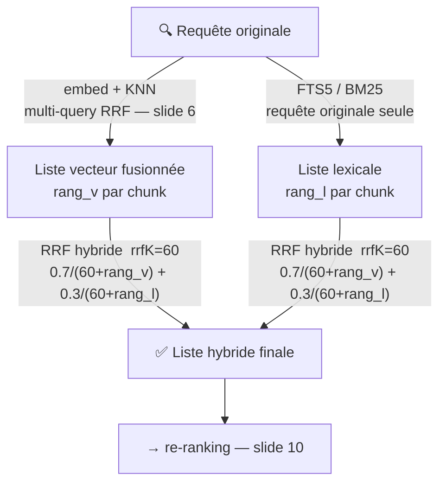

### Pointeurs de code (développeurs)

- `src/semantic-service/search/hybrid-chunk-fusion.utils.ts` — `fuseChunkMatchesWithRRF()`
  - Paramètres : `weightSemantic = 0.7`, `rrfK = 60`
- `src/semantic-service/search/fts5-query-sanitize.utils.ts` — `buildSafeFts5MatchQuery()`
  (tokénise la requête, échappe les caractères spéciaux FTS5)

---

## Slide 9 — Consolidation par fichier : le boost multi-chunks (5 min)

### Message clé

Un fichier avec **4 chunks pertinents** est plus fiable qu'un fichier avec **1 seul chunk**.
On le récompense.

### Contenu

Après la fusion hybride, on a une liste de **chunks** classés.

**Étape 1 — Grouper par fichier**
On regroupe tous les chunks par `fileId`.

**Étape 2 — Compter les "bons" chunks**
Pour chaque fichier, on compte les chunks dont la distance est dans une bande
de **±12%** autour du meilleur chunk du fichier.
Ce comptage est **plafonné à 6** (évite de sur-favoriser les très gros fichiers).

**Étape 3 — Effective Distance**

```
effective_distance = best_chunk_distance / (1 + 0.25 × (nb_chunks_proches − 1))
```

Résultat : un fichier avec 3 bons chunks voit sa distance divisée par 1.5 → il remonte.

### Diagramme

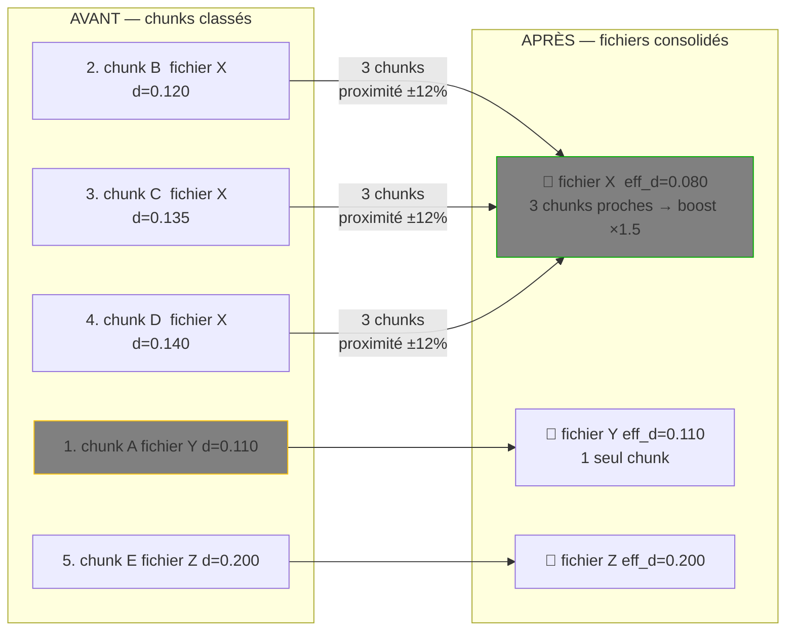

### Pointeurs de code (développeurs)

- `src/semantic-service/search/match-consolidation-by-file.utils.ts`
  - `consolidateSemanticQueryMatchesByFile()` — point d'entrée
  - `buildAggregatedQueryMatchFromFileChunks()` — agrège les chunks d'un fichier
  - `computeEffectiveDistanceForFileHits()` — formule de boost
- Constantes :
  - `FILE_CONSOLIDATION_MULTI_CHUNK_BOOST_WEIGHT = 0.25`
  - `FILE_CONSOLIDATION_PROXIMITY_SLACK = 0.12`
  - `FILE_CONSOLIDATION_MAX_BOOSTED_CHUNK_COUNT = 6`

### Démo

Dans la réponse JSON de `POST /api/semantic-search-workspace-files` :
- Le champ `relatedChunkCount` indique combien de chunks ont contribué au boost
- Chercher `"file consolidation boost scoring"` avec `nbResults: 8`
- Les fichiers avec `relatedChunkCount > 1` ont bénéficié du boost

---

## Slide 10 — Le re-ranker : dernière passe de précision (4 min)

### Message clé

Les modèles d'embedding (bi-encodeurs) sont rapides mais approximatifs.
Le **cross-encoder** regarde la requête ET le chunk ensemble → bien plus précis.

### Contenu

**Bi-encodeur (embedding — phase 1)**
Requête et chunk sont encodés **séparément** → vecteurs comparés par cosinus.
Rapide, scalable. Mais le modèle **ne voit pas la requête** quand il encode le chunk.

**Cross-encodeur (re-ranker — phase 2)**
Requête et chunk sont passés **ensemble** au modèle → score de pertinence direct.
Trop lent pour tout le corpus → on l'applique seulement sur les **top-N candidats** déjà filtrés.

**Pipeline :**
RRF hybride → top candidats → **cross-encoder** → re-tri final → consolidation par fichier

### Diagramme

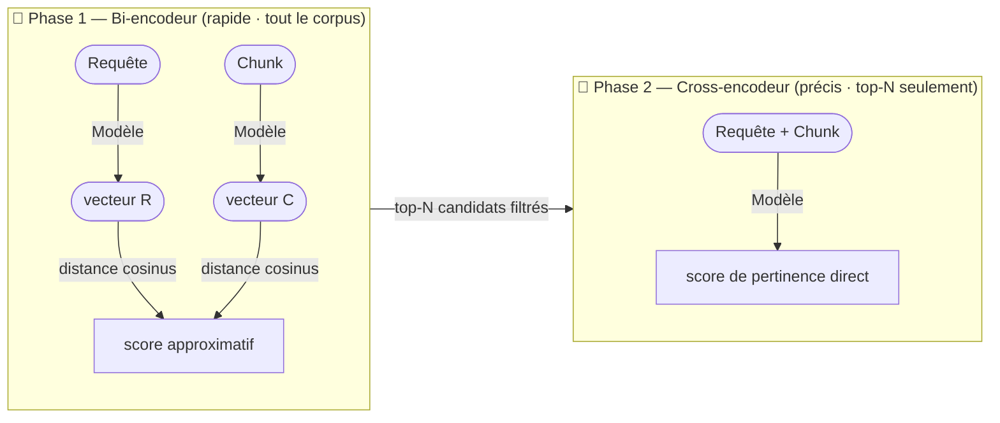

### Pointeurs de code (développeurs)

- `src/semantic-service/search/cross-encoder-rerank.utils.ts` — `rerankWithCrossEncoder()`
  - Transformers.js `text-classification` pipeline avec `text_pair: [query, document]`
  - Normalisation min-max des scores + inversion en distance
  - Fallback gracieux : si le modèle n'est pas configuré, l'ordre hybride est conservé
- Variable d'env : `CODE_CRAWLER_RERANKER_MODEL` (ex. `cross-encoder/ms-marco-MiniLM-L-6-v2`)

### Démo

Montrer le fallback dans le code : si le re-ranker échoue ou n'est pas configuré,
la recherche continue avec l'ordre hybride — la robustesse est explicite dans le code.

---

## Slide 11 — Pipeline complet + démo live (5 min)

### Message clé

Toutes les étapes ensemble — du texte en entrée aux fichiers classés en sortie.

### Diagramme de bout en bout

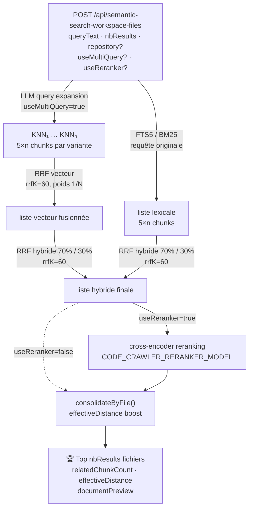

### Pointeurs de code (développeurs)

`src/semantic-service/search/workspace-semantic-query.service.ts` — `runWorkspaceSemanticQuery()`
Le pipeline complet en ~45 lignes séquentielles — excellent point d'entrée pour explorer le code.

### Démo live

1. `yarn start:prod` (ou serveur déjà lancé)
2. `POST /api/prepare-repository-for-semantic-search` si pas encore indexé
3. Recherches représentatives :

   | Requête                            | Ce qu'elle illustre                             |
   |------------------------------------|-------------------------------------------------|
   | `"HTTP retry handling"`            | Puissance sémantique cross-language             |
   | `"file consolidation score boost"` | Retrouve `match-consolidation-by-file.utils.ts` |
   | `"cross encoder reranking"`        | Retrouve `cross-encoder-rerank.utils.ts`        |

4. Sur chaque résultat, commenter les champs :
   - `relatedChunkCount` → combien de chunks ont contribué
   - `effectiveDistance` → distance après boost
   - `documentPreview` → extrait du chunk le plus pertinent avec plages de lignes

---

## Récapitulatif — Pourquoi chaque étape

| Étape                        | Problème résolu                                                                |
|------------------------------|--------------------------------------------------------------------------------|
| Chunking AST                 | Découpage aux frontières syntaxiques réelles, pas au hasard                    |
| Graph hints (Calls/CalledBy) | Contexte de relation entre symboles dans l'embed text                          |
| Multi-query + RRF vecteur    | Une seule formulation peut manquer des variantes sémantiques du même concept   |
| Fetch 5×                     | Assez de matière pour la consolidation sans sur-charger la mémoire             |
| RRF hybride 70/30            | Vecteur = sens · Lexical = noms exacts · RRF = fusion sans normalisation ad hoc|
| Cross-encoder                | Précision finale sur les top candidats déjà filtrés                            |
| Consolidation + boost        | Fichier avec plusieurs signaux pertinents > fichier avec un seul               |

---

## Ressources

- `src/semantic-service/search/workspace-semantic-query.service.ts` — pipeline de recherche complet
- `src/semantic-service/chunking/graph-chunks.ts` — orchestration du chunking
- `docs/DATABASE.md` — schéma SQLite et diagramme ER
- `README.md` — setup, configuration des modèles, variables d'environnement
