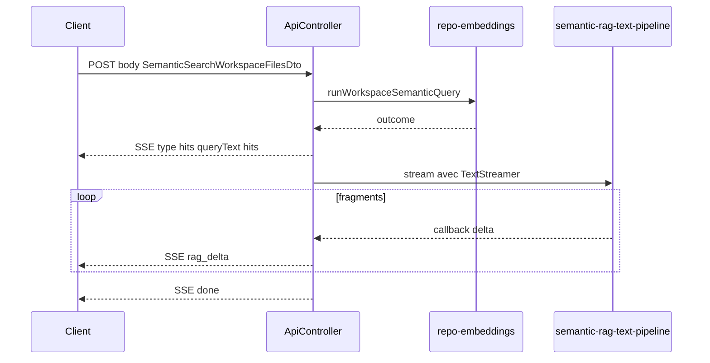

# API SSE pour le RAG sémantique

## Contexte technique

- L’endpoint existant [`semantic-search-workspace-files-rag`](incubator/code-crawler/src/api/api.controller.ts) appelle [`semanticSearchWorkspaceFilesWithRag`](incubator/code-crawler/src/semantic-service/repo-embeddings.utils.ts) qui enchaîne [`runWorkspaceSemanticQuery`](incubator/code-crawler/src/semantic-service/repo-embeddings.utils.ts) puis [`generateRagAnswerFromMatches`](incubator/code-crawler/src/semantic-service/semantic-rag-text-pipeline.utils.ts) (génération **non** streamée aujourd’hui ; le TODO-001 le mentionne déjà).
- Transformers.js v4 expose [`TextStreamer`](https://huggingface.co/docs/transformers.js/en/api/generation/streamers) avec `callback_function` / `token_callback_function` et `skip_prompt: true`, passé à l’appel du pipeline via l’option `streamer` (à valider au moment de l’implémentation sur l’objet retourné par `pipeline("text-generation", …)` — accès typique au tokenizer via la pipeline, ex. propriété `tokenizer`).

## Contrat SSE proposé (JSON dans chaque `data:`)

Même schéma de corps que l’API actuelle ([`SemanticSearchWorkspaceFilesDto`](incubator/code-crawler/src/api/api-request.dto.ts) / `semanticSearchWorkspaceFilesInputSchema`).

Chaque message SSE : une ligne `data: <json>\n\n` (éventuellement préfixée par `event: <nom>` si vous préférez typer côté `EventSource` — avec `fetch` + `ReadableStream`, le parsing par lignes suffit souvent).

Types de charge utile (discriminant `type`) :

| `type` | Rôle |
|--------|------|
| `hits` | `{ queryText, hits }` — **émis dès la fin de la recherche vectorielle**, avant tout appel au pipeline LLM. Le champ **`hits`** (tableau) reprend le même contenu que l’ancien champ `outcome` de la réponse REST quand la recherche réussit (liste consolidée de `QueryMatchSummary`). En cas d’échec de recherche (embedding / requête), utiliser un **champ explicite** `searchError: string` (et `hits: []`) plutôt qu’une forme ambiguë dans `hits`. Le client peut **afficher la liste tout de suite** pendant la génération RAG. |
| `rag_delta` | `{ text }` — fragment de réponse (répété N fois). Préférer `callback_function` de `TextStreamer` (mots / sous-chaînes stabilisées) pour limiter le bruit ; alternative `token_callback_function` si besoin plus fin. |
| `rag_error` | `{ message }` — échec génération (équivalent au message préfixé `Text generation failed:` aujourd’hui). |
| `done` | `{}` ou métadonnées légères — flux terminé avec succès. |

Champs optionnels sur l’événement `type: "hits"` : `skippedRagMessage?: string` lorsqu’aucun modèle texte n’est invoqué (liste vide, etc.) ; `searchError?: string` si la phase recherche a échoué (`hits` alors `[]`).

Ordre nominal des événements : `hits` → zéro ou plusieurs `rag_delta` → `done`. En cas d’échec génération après des `rag_delta` partiels : `rag_error` puis `done` (ou seulement `done` si vous centralisez l’erreur — à rester cohérent dans l’implémentation).

Cas limites alignés sur le comportement actuel de [`semanticSearchWorkspaceFilesWithRag`](incubator/code-crawler/src/semantic-service/repo-embeddings.utils.ts) :

- `outcome` non tableau (erreur recherche) : **`hits`** avec ce `outcome`, puis **`done`** ; pas de `rag_delta` / pas de chargement du modèle texte (équivalent au message « Semantic search failed… » côté REST).
- `outcome` tableau vide : **`hits`** (`outcome: []`, idéalement avec `skippedRagMessage` comme ci-dessus), puis **`done`** — pas de chargement du pipeline texte.

## Implémentation prévue

1. **[`semantic-rag-text-pipeline.utils.ts`](incubator/code-crawler/src/semantic-service/semantic-rag-text-pipeline.utils.ts)**  
   - Importer dynamiquement `TextStreamer` depuis `@huggingface/transformers` (comme le reste du module).  
   - Nouvelle fonction exportée du style `streamRagAnswerFromMatches({ matches, question, onTextChunk })` qui réutilise `buildRagContextFromMatches` / `buildRagPrompt`, instancie `TextStreamer` avec `skip_prompt: true`, appelle le même `getTextGenerationPipeline()` avec `{ streamer, max_new_tokens: 512, return_full_text: false }`, propage les erreurs comme `generateRagAnswerFromMatches`.  
   - Garder `generateRagAnswerFromMatches` pour l’API MCP / REST non-stream (pas de régression).

2. **[`repo-embeddings.utils.ts`](incubator/code-crawler/src/semantic-service/repo-embeddings.utils.ts)** (ou petit module dédié si vous voulez éviter d’alourdir le fichier)  
   - Une fonction async exportée qui encapsule : `runWorkspaceSemanticQuery` → émission **`hits`** (toujours, dès que l’outcome est connu) → court-circuit erreur / liste vide selon les règles ci-dessus → sinon `streamRagAnswerFromMatches` avec callback qui ne connaît pas Express (découplage testable).

3. **[`api.controller.ts`](incubator/code-crawler/src/api/api.controller.ts)**  
   - `@Post("semantic-search-workspace-files-rag-stream")` avec `@Body() body: SemanticSearchWorkspaceFilesDto` et `@Res({ passthrough: false }) res`, et `@Req() req` pour `req.on("close", …)`.  
   - En-têtes SSE : `Content-Type: text/event-stream`, `Cache-Control: no-cache`, `Connection: keep-alive`, et `X-Accel-Buffering: no` (utile derrière nginx). Appeler `res.flushHeaders()` si disponible après les `setHeader`.  
   - Helper local ou fichier util kebab-case (ex. [`api-sse.utils.ts`](incubator/code-crawler/src/api/api-sse.utils.ts)) : `writeSseLine(res, payload)` → `res.write(\`data: ${JSON.stringify(payload)}\n\n\`)`.  
   - `try/catch` + log `Logger` ; si erreur avant headers, JSON d’erreur classique ; une fois le flux SSE ouvert, envoyer `{ type: "rag_error", message }` puis `done` ou fermer proprement.  
   - Toujours `res.end()` en fin de route.

4. **CORS** ([`main.ts`](incubator/code-crawler/src/main.ts))  
   - Aucun changement obligatoire pour `fetch` + `POST` + lecture du corps stream depuis le même schéma d’origine déjà autorisé.  
   - **Note client** : l’API native `EventSource` ne supporte que **GET** ; pour **POST + body**, le client utilisera `fetch` + lecteur de flux (ou librairie SSE) — à mentionner brièvement dans un commentaire JSDoc sur le handler ou dans la doc interne si vous mettez à jour un fichier déjà prévu (ex. TODO-002 dans README seulement si vous décidez de le faire).

5. **Tests manuels / optionnel**  
   - `curl -N -X POST http://127.0.0.1:3333/api/semantic-search-workspace-files-rag-stream -H 'Content-Type: application/json' -d '{"queryText":"..."}'` pour vérifier le flux ligne par ligne.

## Fichiers touchés (résumé)

- [`incubator/code-crawler/src/semantic-service/semantic-rag-text-pipeline.utils.ts`](incubator/code-crawler/src/semantic-service/semantic-rag-text-pipeline.utils.ts) — streaming HF.
- [`incubator/code-crawler/src/semantic-service/repo-embeddings.utils.ts`](incubator/code-crawler/src/semantic-service/repo-embeddings.utils.ts) — orchestration recherche + callbacks événements.
- [`incubator/code-crawler/src/api/api.controller.ts`](incubator/code-crawler/src/api/api.controller.ts) — route SSE.
- Optionnel : [`incubator/code-crawler/src/api/api-sse.utils.ts`](incubator/code-crawler/src/api/api-sse.utils.ts) — formatage SSE réutilisable.

## Risque principal

Si la version exacte de `@huggingface/transformers` (^4.0.1) diffère sur les noms d’options (`streamer` vs autre) ou l’exposition du `tokenizer` sur la pipeline, ajuster après `yarn install` + inspection des types / exécution locale (court spike).
