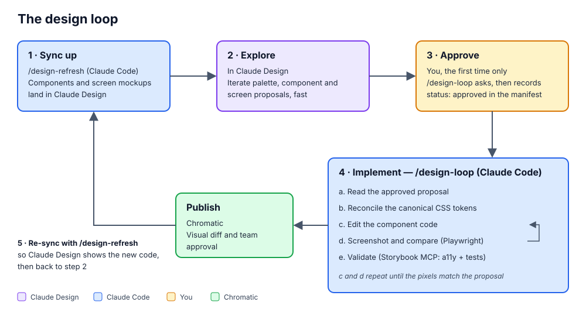

# design

A plugin for running a **Claude Design ↔ Storybook/Chromatic** design-iteration loop against a React codebase.

You explore look-and-feel fast and cheaply inside a [Claude Design](https://claude.ai/design) project, then a Claude Code session implements the approved result in your real components — grounded in your design tokens, verified with Playwright screenshots and Storybook tests, and published to Chromatic.

## Prerequisites

Make sure that you have the Claude Design MCP installed and Claude Code's DesignSync enabled:

1. Install the Claude Design MCP: `claude mcp add --scope user --transport http claude-design https://api.anthropic.com/v1/design/mcp`
2. In Claude Code, run `/design-login`
3. Check in `/plugins` that the MCP connection is successful; if not, select the MCP and reconnect.
4. Check that `/design sync` is listed. The plugin uses the built-in DesignSync tool to create the design-system project and to upload the palette card. If only `/design consent` and `/design revoke` show up, look in the project's `.claude/settings*.json` for:
   - `"DesignSync"` in `permissions.deny`: remove it.
   - `"disableBundledSkills": true`: set it to `false`, and turn off the bundled skills you do not want with `skillOverrides` (`"<skill>": "off"`).

   Then start a new session.

## Installation

In Claude Code, run `/design-init`. It checks the prerequisites above and what the project already has (Tailwind, Storybook, Chromatic), asks before changing anything, treats Tailwind and Chromatic as optional, and reviews an existing Storybook for the loop. It runs `/storybook-init` and `/chromatic-init` for you; run
those directly only to (re)configure one piece.

## Usage

In Claude Design, change the palette card, or ask for a proposal of a component change
(`proposals/<name>.html`, see [`references/proposals.md`](./references/proposals.md)), then in
Claude Code run `/design-loop`. The first time it finds a proposal it asks whether to implement
it and records `status: approved` in `design.manifest.json`; after that, each new edit of the
proposal is picked up without asking again.

To design a whole page, bring it in first: `/design-refresh add the Home page` (or tell
`/design-loop` to). It rebuilds the page as a mockup from the synced components, checked against
the running app, with no change to the app ([`references/screens.md`](./references/screens.md)).
Propose changes in `proposals/screens/<name>.html` and approve them like a component.

Run `/design-refresh` to bring Claude Design up to date with the code (design-loop offers it
after implementing): it tells you when the components are behind their code (then run
`/design-sync`, which only you can start), and rebuilds the mockups whose screen changed.
After updating the design plugin, it also offers the newer `palette.ts`, proposal conventions,
navbar and cards (`design.manifest.json` records the plugin version the project is at).

## Skills

| Skill            | Role                                                                                                                                                                                                                                                                                                                                                                                                  |
| ---------------- | ----------------------------------------------------------------------------------------------------------------------------------------------------------------------------------------------------------------------------------------------------------------------------------------------------------------------------------------------------------------------------------------------------- |
| `design-init`    | One-time setup orchestrator for an existing React or React Native project. Runs the setup sub-skills below and verifies the result.                                                                                                                                                                                                                                                                   |
| `design-palette` | Creates or migrates the canonical theme palette (light/dark inputs → scales → semantic tokens), generates one theme shared by web and React Native plus namespaced Tailwind utilities (`text-noa-muted`) or Sass names (`$text-muted`), carries hand-authored spacing, type and breakpoint tokens for projects without Tailwind, copies the generator (`palette.ts`, Node 22.18+) into the repo with a `palette` package script, audits contrast, and provides a live palette card for Claude Design that edits the colors, the hand-authored token values and, in its Advanced view, which token each semantic token points to. Used by `design-init`. |
| `storybook-init` | Installs Storybook, wires the Storybook MCP server, and confirms Playwright can screenshot stories. Used by `design-init`.                                                                                                                                                                                                                                                                            |
| `chromatic-init` | Adds Chromatic visual testing (the publish/approval gate). Runs after `storybook-init`. Used by `design-init`.                                                                                                                                                                                                                                                                                        |
| `design-loop`    | The runtime skill. Reads an approved component or screen proposal (or the palette card) from Claude Design and implements it in React, converging via screenshots + tests, then pushes to Chromatic. Routes page and refresh requests to `design-refresh`.                                                                                                                                        |
| `design-refresh` | The one skill for updating Claude Design: says when the components need a `/design-sync`, rebuilds stale screen mockups, offers new screens, and adds a named page or fixes a mockup, checked against screenshots of the running app. After a plugin update it brings the project's copies of the plugin's files (`palette.ts`, the proposal conventions in the design-sync readme header, the navbar, the palette and Tailwind cards) up to date, keeping the card's data and the project's wording; `design-loop` runs the same check before implementing.                         |
| `design-help` | Shows this README in the browser, or in the console with `/design-help console`. Run it yourself. |

## The contract

All the skills agree on one shared contract — the manifest schema, the Claude Design ↔ local mapping, the approval signal, and the token-reconciliation rules. See [`references/design-contract.md`](./references/design-contract.md). Read it before changing any skill.
